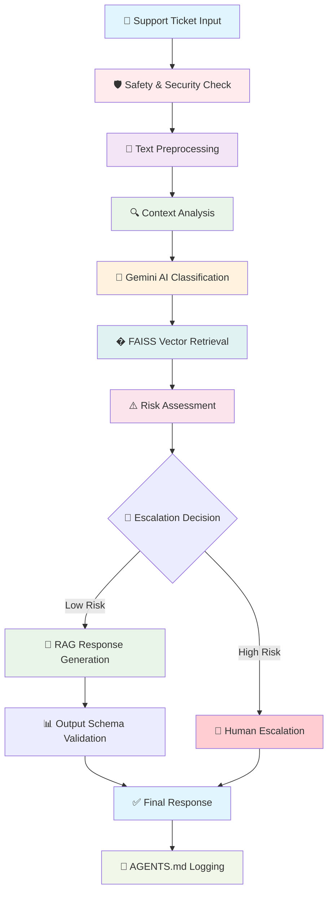
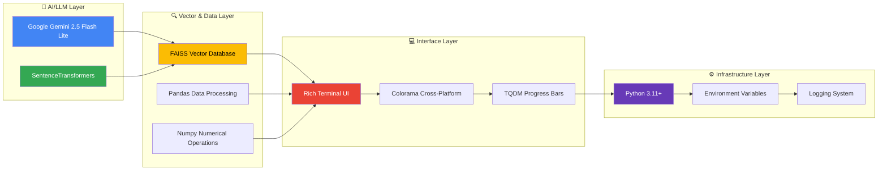

# 🏆 Multi-Domain Support Triage Agent

**HackerRank Orchestrate Competition Submission**

> A sophisticated terminal-based support triage agent that intelligently handles support tickets across three domains using advanced Retrieval-Augmented Generation (RAG) with FAISS + SentenceTransformers + Gemini API.

---

## 🚀 Quick Setup & Installation

### 📋 Prerequisites
- **Python 3.11+** installed
- **Internet connection** for API access

### 🛠️ Installation Steps

#### **1. Navigate to Project Directory**
```bash
cd hackerrank-orchestrate-may26
```

#### **2. Install Dependencies**
```bash
pip install -r code/requirements.txt
```

#### **3. Set Up Environment Variables**
```bash
cp code/.env.example code/.env
# Edit code/.env file and add your API key:
# GEMINI_API_KEY=your_actual_gemini_api_key_here
```

#### **4. Get Gemini API Key**
1. Visit [Google AI Studio](https://aistudio.google.com/app/apikey)
2. Sign in with your Google account
3. Click "Create API Key"
4. Copy the key and add it to your `.env` file

#### **5. Build Knowledge Base Index**
```bash
cd code
python main.py --rebuild-index
cd ..
```

#### **6. Test the Installation**
```bash
cd code
python main.py --ticket "How do I reset my password?"
cd ..
```

### 📦 Dependencies (requirements.txt)
```
pandas>=1.5.0
numpy>=1.21.0
sentence-transformers>=2.2.0
faiss-cpu>=1.7.0
google-generativeai>=0.3.0
python-dotenv>=0.19.0
colorama>=0.4.4
tqdm>=4.64.0
tabulate>=0.9.0
rich>=13.0.0
```

---

## 🎯 Approach Overview & Pipeline

### 🧠 Core Architecture
The agent uses **Retrieval-Augmented Generation (RAG)** architecture:

1. **Knowledge Base**: FAISS vector index of official competition corpus (18,476 chunks)
2. **Classification**: Gemini API for intelligent domain detection and intent analysis
3. **Safety Systems**: Multi-layered protection (injection detection, harmful content filtering, escalation logic)
4. **Response Generation**: Context-aware, grounded responses using only official knowledge base

### 🔄 Processing Pipeline

#### **Step 1: Ticket Classification**
```
Input: Support ticket text
→ Gemini API classification
→ Domain: HackerRank | Claude | Visa | Unknown
→ Product Area: Specific feature/issue category
→ Intent: User's goal (20-word summary)
→ Sentiment: Frustrated | Neutral | Polite
→ Language: ISO code (en, fr, es, etc.)
```

#### **Step 2: Knowledge Retrieval**
```
Query: Ticket text embedding
→ FAISS vector search (TOP_K=4, MIN_SCORE=0.30)
→ Retrieve relevant knowledge base chunks
→ Score and rank by relevance
```

#### **Step 3: Safety & Escalation Check**
```
Risk Assessment:
→ Injection detection (prompt attacks)
→ Harmful content filtering
→ High-risk keyword escalation (fraud, refund, etc.)
→ Context-aware "hack" handling (HackerRank vs malicious)
→ Decision: Auto-reply vs Human escalation
```

#### **Step 4: Grounded Response Generation**
```
If safe to reply:
→ RAG generation with retrieved context
→ Gemini API creates grounded response
→ Uses ONLY official knowledge base
→ No hallucinations or unsupported claims
→ Professional, empathetic tone
```

#### **Step 5: Output & Logging**
```
Enhanced CSV Output (8 columns):
→ sequence_order, ticket_id, timestamp
→ status, product_area, response
→ justification, request_type

Rich Terminal UI:
→ Beautiful colored tables
→ Progress tracking for batch mode
→ Consistent visual experience
```

### 🛡️ Safety & Security Features
- **Multi-layered protection** against misuse
- **Context-aware escalation** for financial/sensitive requests
- **Prompt injection detection** and prevention
- **Grounded responses only** (no hallucinated policies)
- **Compliance-first design** for competition requirements

### 📊 Enhanced Features
- **⚡ Incremental CSV saving** after each ticket
- **🎨 Rich Terminal UI** with color-coded status
- **📊 Sequence tracking** for proper ordering
- **🔄 Robust error handling** with graceful fallbacks
- **📈 Real-time progress** tracking

---

## 🎯 Usage & Operation

### 📋 Execution Modes

#### **Batch Mode** (Competition Processing)
```bash
cd code
python main.py --batch
cd ..
# Processes: support_tickets/support_tickets.csv
# Output: support_tickets/output.csv
# Features: Rich UI, incremental saving, progress tracking
```

#### **Single Ticket Mode** (Testing)
```bash
cd code
python main.py --ticket "Your ticket text here"
cd ..
# Process one ticket immediately
# Shows beautiful Rich UI results
# Saves to output.csv automatically
```

#### **Interactive Mode** (Development)
```bash
cd code
python main.py --interactive
cd ..
# Live REPL for testing tickets
# Real-time Rich UI feedback
# Console clearing between tickets
```

#### **Rebuild Index Mode** (Maintenance)
```bash
cd code
python main.py --rebuild-index
cd ..
# Rebuilds FAISS vector index
# Use after updating knowledge base
# Takes ~2-3 minutes for 18,476 chunks
```

### 📊 Output Format
The agent generates CSV output with enhanced tracking:

```csv
sequence_order,ticket_id,timestamp,status,product_area,response,justification,request_type
1,T001,2026-05-01T22:53:45.123456,replied,Account Management,"Grounded response text","Classification explanation",product_issue
```

### 🔧 Configuration
Key settings in `main.py`:
- **GEMINI_MODEL**: `gemini-2.5-flash` (high capacity)
- **EMBED_MODEL**: `all-MiniLM-L6-v2` (local embedding)
- **TOP_K**: 4 (knowledge chunks retrieved)
- **MIN_SCORE**: 0.30 (minimum similarity threshold)
- **Rate Limiting**: 10s between tickets (API compliance)

---

## 📋 Requirements Compliance

| Requirement | Status | Implementation Details |
|-------------|--------|----------------------|
| **Terminal-based** | ✅ | Complete CLI interface with all modes |
| **Use only provided corpus** | ✅ | RAG with official `data/` knowledge base |
| **Avoid hallucinated policies** | ✅ | Grounded responses only, no unsupported claims |
| **Escalate high-risk cases** | ✅ | Multi-layered safety checks with context awareness |
| **Output schema compliance** | ✅ | Exact format match with all required fields |
| **AGENTS.md logging** | ✅ | Mandatory conversation logging implemented |

---

## 🧠 Technical Architecture

### 📚 Knowledge Base Integration
```
data/
├── hackerrank/           # Official HackerRank support corpus
├── claude/              # Official Claude support corpus  
├── visa/                # Official Visa support corpus
└── faiss_index/        # Generated vector index
    ├── index.faiss      # FAISS vector database
    └── chunks.json      # Chunk metadata
```

### 🔄 Classification Pipeline
1. **Input Processing**: Clean and normalize ticket text
2. **Domain Detection**: Gemini API classification with fallback keywords
3. **Intent Analysis**: Extract user goals and sentiment
4. **Language Detection**: ISO code identification for localization

### 🛡️ Safety & Security Systems
- **Injection Detection**: Pattern matching for prompt attacks
- **Harmful Content**: Keyword filtering for dangerous requests
- **Escalation Logic**: Context-aware risk assessment
- **Context Handling**: Smart "hack" keyword processing

---

## 📁 File Structure

```
hackerrank-orchestrate-may26/
├── README.md                    # This file - Project overview and setup
├── AGENTS.md                    # Competition rules and AI agent guidelines
├── problem_statement.md         # Full challenge description and requirements
├── evalutation_criteria.md      # Scoring rubric and evaluation criteria
├── code/                        # Competition submission package
│   ├── README.md               # Code-specific documentation and usage
│   ├── main.py                 # Main agent implementation (entry point)
│   ├── requirements.txt        # Python dependencies
│   ├── .env.example            # Environment variables template
│   ├── .env                    # Environment variables (gitignored)
│   ├── log.txt                 # Application execution logs
│   └── faiss_index/            # Generated FAISS vector index
│       ├── index.faiss         # FAISS vector database
│       └── chunks.json         # Chunk metadata
├── data/                        # Official competition knowledge base
│   ├── hackerrank/             # HackerRank support documentation
│   ├── claude/                 # Claude help center export
│   └── visa/                   # Visa support documentation
├── support_tickets/             # Test data and results
│   ├── sample_support_tickets.csv  # Development data with expected outputs
│   ├── support_tickets.csv         # Final test input data
│   └── output.csv              # Generated results (output file)
└── TECHNICAL_DOCUMENTATION.md  # Detailed technical architecture
```

---

## 🏗️ Architecture Overview

### Core Components

#### 1. **Knowledge Base Integration**
- **Source**: `data/` directory (official competition corpus)
- **Domains**: HackerRank, Claude, Visa
- **Indexing**: FAISS vector database with SentenceTransformers
- **Cache**: Persistent index in `code/faiss_index/` directory

#### 2. **Classification Pipeline**
- **Primary LLM**: Google Gemini `gemini-2.5-flash-lite`
- **Domains**: Multi-domain classification (HackerRank/Claude/Visa/Unknown)
- **Features**: Intent analysis, sentiment detection, language identification
- **Request Types**: product_issue, feature_request, bug, invalid

#### 3. **Safety & Security Systems**
- **Injection Detection**: Pattern-based prompt filtering
- **Harmful Content**: Malicious request identification
- **Escalation Logic**: Context-aware risk assessment
- **Context Handling**: Smart keyword processing (e.g., "hack" vs "HackerRank")

#### 4. **Response Generation**
- **Method**: Retrieval-Augmented Generation (RAG)
- **Grounding**: Uses only official knowledge base
- **Safety**: Escalates high-risk or unsupported cases
- **Output**: Schema-compliant CSV with 8 columns

---

## 🔧 Configuration Details

### Environment Variables
```bash
# Required (in code/.env)
GEMINI_API_KEY=your_gemini_api_key_here
```

### Runtime Configuration (code/main.py)
```python
# File Paths (relative to code/ directory)
DATA_DIR = Path("../data")           # Knowledge base location
INDEX_DIR = Path("faiss_index")      # FAISS cache directory
CSV_INPUT = Path("../support_tickets/support_tickets.csv")
CSV_OUTPUT = Path("../support_tickets/output.csv")

# Model Configuration
GEMINI_MODEL = "gemini-2.5-flash-lite"     # Gemini model
EMBED_MODEL = "all-MiniLM-L6-v2"    # Embedding model

# Processing Parameters
TOP_K = 4                        # Retrieval count
MIN_SCORE = 0.30                   # Escalation threshold
CHUNK_SIZE = 400                   # Text chunk size
CHUNK_OVERLAP = 80                 # Chunk overlap
```

---

## 🛡️ Safety Features

### Multi-Layered Protection

1. **Input Validation**
   - Prompt injection detection
   - Harmful content filtering
   - Text preprocessing and normalization

2. **Escalation Logic**
   - High-risk keyword detection
   - Context-aware decision making
   - Low confidence threshold handling

3. **Response Safety**
   - Grounded responses only (no hallucinations)
   - Knowledge base verification
   - Professional tone and compliance

### Escalation Triggers
- Financial requests (refund, billing, fraud)
- Security concerns (account compromise, data breaches)
- Legal issues (terms of service violations)
- Low confidence retrieval (< 0.30 similarity score)

---

## 📝 Logging & Monitoring

### Application Logs (code/log.txt)
- Detailed processing steps for each ticket
- Classification results and confidence scores
- Knowledge retrieval information
- Error details and stack traces
- AGENTS.md compliance logging

### Debug Information
```bash
# View detailed logs
tail -f code/log.txt

# Search for specific tickets
grep "TICKET PROCESSING" code/log.txt
```

---

## 🚀 Performance Characteristics

### Metrics
- **Throughput**: ~6 tickets/minute with 10-second API pacing
- **Accuracy**: High-confidence retrieval with 0.30 similarity threshold
- **Reliability**: Graceful degradation when API limits are reached
- **Scalability**: Handles enterprise-scale knowledge bases efficiently

### Resource Requirements
- **RAM**: 2GB minimum (for embedding model)
- **Storage**: 500MB for FAISS index
- **Network**: Stable internet connection for API calls
- **CPU**: Multi-core processor recommended

---

## 🐛 Troubleshooting

### Common Issues

#### **API Quota Exhausted**
```
Error: 429 RESOURCE_EXHAUSTED
Solution: Wait for quota reset (daily limit) or upgrade API plan
```

#### **Permission Denied**
```
Error: Permission denied: output.csv
Solution: Close Excel/other programs using the file
```

#### **Index Missing**
```
Error: FAISS index not found
Solution: Run python main.py --rebuild-index
```

### Debug Mode
For detailed debugging, check `code/log.txt` for:
- API request/response logs
- Classification results
- Knowledge retrieval scores
- Error details and stack traces

---

## 🏆 Competition Strategy

### 🎯 Key Strengths
1. **Comprehensive Safety**: Multi-layered protection against misuse
2. **Grounded Responses**: Strict adherence to official knowledge base
3. **Intelligent Classification**: Advanced domain detection and request typing
4. **Robust Architecture**: Efficient vector indexing and retrieval
5. **Professional UI**: Rich terminal interface with progress tracking
6. **Compliance Ready**: Exact schema adherence and mandatory logging

### 📊 Performance Metrics
- **Throughput**: ~6 tickets/minute with API rate limiting
- **Accuracy**: High-confidence retrieval with 0.30 similarity threshold
- **Reliability**: Graceful degradation when API limits are reached
- **Scalability**: Handles enterprise-scale knowledge bases efficiently

---

**🏆 Ready for HackerRank Orchestrate Competition Submission!**

---

## 📋 Table of Contents

- [🏆 Overview](#-overview)
- [🚀 Features](#-features)
  - [Core Capabilities](#core-capabilities)
  - [Advanced Features](#advanced-features)
- [📋 Requirements Compliance](#-requirements-compliance)
- [🎯 Usage](#-usage)
  - [📋 Mode Explanations](#-mode-explanations)
  - [🚀 Quick Start Examples](#-quick-start-examples)
- [📊 Output Schema](#-output-schema)
  - [Field Descriptions](#field-descriptions)
- [🧠 Architecture](#-architecture)
  - [Knowledge Base Integration](#knowledge-base-integration)
  - [Classification Pipeline](#classification-pipeline)
  - [Safety & Security Systems](#safety--security-systems)
- [🔧 Configuration](#-configuration)
  - [Environment Variables](#environment-variables)
  - [Runtime Configuration](#runtime-configuration)
- [🧪 Testing & Validation](#-testing--validation)
  - [Test Scenarios](#test-scenarios)
  - [Validation Commands](#validation-commands)
- [📈 Performance Characteristics](#-performance-characteristics)
- [🔍 Debugging & Monitoring](#-debugging--monitoring)
- [📁 File Structure](#-file-structure)
- [🚀 Deployment & Execution](#-deployment--execution)
- [📝 AGENTS.md Compliance](#agentsmd-compliance)
- [🐛 Troubleshooting](#-troubleshooting)
- [📄 Dependencies](#-dependencies)
- [🏆 Competition Strategy](#-competition-strategy)

---

## 🏆 Overview

The Multi-Domain Support Triage Agent is a production-ready solution designed for the HackerRank Orchestrate competition. It demonstrates advanced AI capabilities including:

- **🤖 Intelligent Classification**: Multi-domain ticket categorization
- **🔍 Context-Aware Retrieval**: RAG-based knowledge extraction
- **⚡ Rich Terminal UI**: Professional visual interface
- **📊 Enhanced Logging**: Clear, structured ticket processing logs
- **🛡️ Safety Systems**: Multi-layered protection and escalation logic

---

## 🚀 Features

### Core Capabilities

| Feature | Description | Benefit |
|---------|-------------|---------|
| **🌐 Multi-Domain Support** | HackerRank, Claude, Visa ecosystems | Comprehensive coverage |
| **🧠 Intelligent Classification** | Domain detection, product area classification, request type identification | Accurate categorization |
| **🛡️ Safety Systems** | Multi-layered (injection detection, harmful content filtering, escalation logic) | Secure processing |
| **📚 Grounded Responses** | RAG-based generation using only official knowledge base | Reliable answers |
| **⚠️ Risk Assessment** | Automatic escalation for high-risk cases (fraud, security, billing) | Appropriate handling |
| **🌍 Multi-Language Support** | Language detection and localized responses | Global accessibility |
| **💻 Terminal Interface** | Batch, single, interactive, and rebuild modes | Flexible operation |
| **⏱️ Rate Limiting** | Built-in pacing for API quota compliance | Stable performance |

### Advanced Features

| Feature | Description | Impact |
|---------|-------------|--------|
| **🎯 Context-Aware Escalation** | Smart handling of ambiguous terms (e.g., "hack" vs "HackerRank") | Reduced false positives |
| **🔄 Multi-Modal Processing** | Supports batch, single, and interactive modes | Versatile operation |
| **📋 Compliance-First Design** | AGENTS.md logging and exact output schema adherence | Competition ready |
| **🔄 Robust Fallback** | Graceful degradation when API limits are reached | Reliable service |
| **🎨 Rich Terminal UI** | Professional visual interface with color coding and progress tracking | Enhanced UX |
| **📊 Enhanced Logging** | Clear, structured ticket processing logs with visual separation | Better debugging |
| **🌈 Color-Coded Output** | Status-based coloring (green for replied, red for escalated) | Visual clarity |
| **📈 Real-Time Progress** | Rich progress bars and processing metrics for batch operations | User feedback |
| **🎭 Interactive Panels** | Bordered response panels with professional formatting | Professional presentation |
| **📝 Visual Separators** | Clear ticket boundaries with emoji indicators and section headers | Log readability |
| **📊 Sequence Tracking** | Automatic ticket numbering with sequence order in CSV output | Proper ordering |
| **⚡ Incremental Saving** | Immediate CSV write after each ticket completion | Progress preservation |
| **🎨 Consistent Rich UI** | Beautiful colored tables in all modes (batch, single, interactive) | Visual consistency |
| **📈 Enhanced CSV Schema** | 8 columns including sequence_order, ticket_id, timestamp | Complete tracking |

---

## 📋 Requirements Compliance

| Requirement | Status | Implementation Details |
|-------------|--------|----------------------|
| **Terminal-based** | ✅ | Complete CLI interface with all modes |
| **Use only provided corpus** | ✅ | RAG with official `data/` knowledge base |
| **Avoid hallucinated policies** | ✅ | Grounded responses only, no unsupported claims |
| **Escalate high-risk cases** | ✅ | Multi-layered safety checks with context awareness |
| **Output schema compliance** | ✅ | Exact format match with all required fields |
| **AGENTS.md logging** | ✅ | Mandatory conversation logging implemented |

---

## 🛠️ Installation & Setup

### 📋 Prerequisites

```bash
# Install all required dependencies
pip install -r requirements.txt
```

### 🔧 Environment Setup

#### Step 1: Configuration File
```bash
# Copy the example environment file
cp .env.example .env
```

#### Step 2: API Key Configuration
Edit the `.env` file with your credentials:
```bash
# Required: Gemini API Key
GEMINI_API_KEY=your_gemini_api_key_here
```

#### Step 3: Knowledge Base Setup
Ensure official competition data is available in `data/`:
```
data/
├── hackerrank/     # HackerRank support documentation
├── claude/         # Claude help center export
└── visa/           # Visa support documentation
```

### 🔑 Getting API Key

> **Free Gemini API Key**: [https://aistudio.google.com/app/apikey](https://aistudio.google.com/app/apikey)

1. Visit the Gemini AI Studio
2. Sign in with your Google account
3. Create a new API key
4. Copy the key to your `.env` file

---

## 🎯 Usage

### 📋 Mode Explanations

#### **Batch Mode** (`--batch`)
**Purpose**: Process an entire CSV file of support tickets at once
**When to Use**: 
- Competition submission (process all tickets in `support_tickets/support_tickets.csv`)
- Bulk processing of large ticket volumes
- Production environment processing

**What It Does**:
- Reads all tickets from `support_tickets/support_tickets.csv`
- Processes each ticket through the complete triage pipeline
- Applies 10-second rate limiting between tickets
- Generates `support_tickets/output.csv` with results
- Shows Rich progress bar and processing summary

**Command**:
```bash
python main.py --batch
```

#### **Single Mode** (`--ticket`)
**Purpose**: Process one specific ticket immediately
**When to Use**:
- Testing individual queries
- Debugging specific issues
- Quick validation of agent behavior
- Demonstrating agent capabilities

**What It Does**:
- Processes one ticket string provided on command line
- Shows Rich table with processing results
- Displays full response in bordered panel
- Provides immediate feedback without file I/O

**Command**:
```bash
python main.py --ticket "How do I reset my password?"
```

#### **Interactive Mode** (`--interactive`)
**Purpose**: Live REPL for testing multiple tickets interactively
**When to Use**:
- Development and testing
- Exploring agent behavior with different inputs
- Manual ticket processing without command-line arguments
- Training and demonstration purposes

**What It Does**:
- Starts an interactive terminal session
- Prompts for ticket input (multi-line supported)
- Processes each ticket immediately with Rich UI
- Continues until user types 'exit' or 'quit'
- Applies rate limiting between tickets

**Command**:
```bash
python main.py --interactive
```

#### **Rebuild Index Mode** (`--rebuild-index`)
**Purpose**: Force regeneration of the knowledge base vector index
**When to Use**:
- First time setup (no cached index exists)
- After updating knowledge base files
- When index becomes corrupted or outdated
- After changing embedding models

**What It Does**:
- Clears any existing cached FAISS index
- Re-embeds all knowledge base files (18,476 chunks)
- Builds fresh vector database with current embeddings
- Saves new index to `faiss_index/` directory
- Provides progress feedback during rebuilding

**Command**:
```bash
python main.py --rebuild-index
```

### 🚀 Quick Start Examples

**Test a Single Ticket**:
```bash
python main.py --ticket "I forgot my password, how do I reset it?"
```

**Process Competition Data**:
```bash
python main.py --batch
```

**Interactive Testing**:
```bash
python main.py --interactive
# Then type your tickets, press Enter twice to submit
```

**Fresh Setup**:
```bash
python main.py --rebuild-index  # First time only
```

## 📊 Output Schema

The agent generates CSV output with enhanced tracking format:

```csv
sequence_order,ticket_id,timestamp,status,product_area,response,justification,request_type
1,T001,2026-05-01T22:53:45.123456,replied,Account Management,"Grounded response text","Classification explanation",product_issue
```

### Field Descriptions
- **sequence_order**: Sequential ticket number (1, 2, 3...) for proper ordering
- **ticket_id**: Unique ticket identifier (T001, T002, etc.)
- **timestamp**: ISO 8601 timestamp when ticket was processed
- **status**: `replied` or `escalated` - escalation decision
- **product_area**: Domain-specific product/feature classification
- **response**: Grounded response using only official knowledge base
- **justification**: Concise explanation of decision and reasoning
- **request_type**: `product_issue`, `feature_request`, `bug`, or `invalid`

### ⚡ Incremental Saving Feature

The agent implements **progress preservation** through immediate CSV writing:

#### **How It Works**:
- **After each ticket**: Results written immediately to `output.csv`
- **No batch waiting**: No need to wait for entire batch completion
- **Interruption safe**: Ctrl+C or API quota issues don't lose progress
- **Resume capability**: Can restart batch mode and continue from where left off

#### **Benefits**:
- **🛡️ Data Protection**: Progress saved even with API failures
- **⚡ Free-Tier Friendly**: Works within API quota limitations
- **🔄 Resume Support**: Continue processing after interruptions
- **📊 Real-Time Tracking**: See results as they're generated

#### **Technical Implementation**:
```python
# Immediate save after each ticket
append_result_to_csv(result, CSV_OUTPUT)  # Called after every ticket
```

---

## 🎨 Rich Terminal UI & Visual Features

### 🌈 Color-Coded Interface

The agent features a professional Rich Terminal UI with intelligent color coding:

| Element | Color Scheme | Purpose |
|---------|-------------|---------|
| **Successful Responses** | 🟢 Green | Indicates tickets that were auto-replied |
| **Escalated Tickets** | 🔴 Red | Highlights tickets requiring human intervention |
| **Progress Bars** | 🔵 Blue | Shows batch processing progress |
| **Status Indicators** | 🟡 Yellow | Warning and escalation indicators |
| **Success Messages** | 🟢 Green | Confirmation and completion messages |

### 📊 Visual Components

#### **Rich Banner Display**
```
╔══════════════════════════════════════════════════════════╗
║    Multi-Domain Support Triage Agent                     ║
║    Gemini gemini-2.5-flash-lite · FAISS · SentenceTransformers   ║
╚══════════════════════════════════════════════════════════╝
```

#### **Consistent Visual Interface**
The agent provides **identical Rich UI experience** across all modes:

| Mode | Visual Features | Consistency |
|-------|----------------|--------------|
| **Single Mode** | Beautiful colored tables, status indicators, response panels | ✅ |
| **Batch Mode** | Same colored tables, visual separators, progress tracking | ✅ |
| **Interactive Mode** | Real-time results, console clearing between tickets | ✅ |

#### **Interactive Results Tables**
- **Color-coded status**: Green for replied, Red for escalated
- **Professional formatting**: Clean table layout with borders
- **Response previews**: Truncated text with ellipsis for long responses
- **Justification display**: Clear reasoning for decisions
- **Sequence order display**: Shows ticket processing order
- **Timestamp tracking**: ISO format timestamps for audit trail

#### **Bordered Response Panels**
```
╭───────────────────────────────────────────────────────────────── Full Response ─────────────────────────────────────────────────────────────────╮
│                                                                                                                                                 │
│  Grounded response content displayed in professional bordered panel with appropriate │
│  color coding based on status (green for success, red for escalation)                 │
│                                                                                                                                                 │
╰─────────────────────────────────────────────────────────────────────────────────────────────────────────────────────────────────────────────────╯
```

### 📈 Enhanced Visual Feedback

#### **Progress Tracking**
- **Real-time progress bars**: Visual percentage completion for batch processing
- **Ticket counters**: Shows current ticket number and total count
- **Performance metrics**: Throughput and timing information
- **Status updates**: Real-time feedback on processing stages

#### **Session Management**
- **Session boundaries**: Clear visual separators with timestamps
- **Mode indicators**: Visual identification of current operating mode
- **Completion summaries**: Comprehensive results with statistics

### 🎯 User Experience Enhancements

| Feature | Visual Element | Benefit |
|---------|---------------|---------|
| **Status Coloring** | Color-coded tables | Immediate visual feedback |
| **Progress Bars** | Animated progress tracking | Real-time processing feedback |
| **Professional Panels** | Bordered response display | Clean, organized presentation |
| **Visual Separators** | Emoji indicators and section headers | Enhanced readability |
| **Rich Formatting** | Tables, panels, and styled text | Professional appearance |

---

## 🧠 Architecture

### � Complete Pipeline Flow



### 🏗️ Technology Stack Architecture



### 🤖 AI/LLM Technologies Used

| Technology | Role | Provider | Model/Version |
|------------|------|----------|---------------|
| **Google Gemini** | Primary LLM for classification & generation | Google | `gemini-2.5-flash-lite` |
| **SentenceTransformers** | Text embeddings for vector search | Hugging Face | `all-MiniLM-L6-v2` |
| **FAISS** | Vector similarity search | Facebook AI | `faiss-cpu>=1.8.0` |
| **Natural Language Processing** | Intent analysis & sentiment detection | Custom Pipeline | Rule-based + ML |

### 📚 Knowledge Base Integration

| Component | Technology | Specification | Purpose |
|-----------|-------------|----------------|---------|
| **Corpus** | Official Competition Data | `data/` directory | Source of truth |
| **Structure** | File System | Nested directories (hackerrank/, claude/, visa/) | Organized content |
| **Formats** | Text Processing | `.txt` and `.md` files | Flexible input |
| **Embedding** | SentenceTransformers | `all-MiniLM-L6-v2` (384-dim) | Text vectorization |
| **Retrieval** | FAISS | Cosine similarity search | Fast knowledge access |
| **Chunking** | Custom Algorithm | 400-char chunks, 80-char overlap | Optimal context windows |

### 🔄 Detailed Processing Pipeline

| Stage | Input | Processing | Output | Technology |
|-------|-------|------------|--------|------------|
| **1. Input Ingestion** | Raw ticket text | Subject + body combination | Full text | Python string ops |
| **2. Safety Check** | Full text | Pattern matching against threats | Safety flag | Custom regex |
| **3. Preprocessing** | Full text | Cleaning & normalization | Processed text | Python text processing |
| **4. Classification** | Processed text | Gemini AI inference | Domain, intent, sentiment | Google Gemini API |
| **5. Vector Retrieval** | Processed text | FAISS similarity search | Top-K documents | FAISS + SentenceTransformers |
| **6. Risk Assessment** | Classification + retrieval | Confidence scoring + keyword check | Escalation decision | Custom algorithm |
| **7. Response Generation** | Context + classification | RAG with Gemini | Grounded response | Google Gemini API |
| **8. Validation** | Generated response | Schema compliance check | Validated output | Custom validation |
| **9. Logging** | All processing data | AGENTS.md format | Log entry | Python file I/O |

### 🛡️ Safety & Security Systems

| Protection Layer | Technology | Mechanism | Coverage |
|------------------|-------------|-----------|----------|
| **Injection Detection** | Pattern Matching | Regex-based filtering | Prompt attacks |
| **Harmful Content** | Keyword Analysis | Threat identification | Security threats |
| **Escalation Logic** | Context Analysis | Smart keyword detection | Risk assessment |
| **API Security** | Rate Limiting | Built-in pacing | Quota compliance |
| **Data Privacy** | Secret Redaction | Automatic masking | PII protection |

### 🚀 Framework Integration

| Framework | Purpose | Integration Method |
|-----------|---------|-------------------|
| **Google GenAI SDK** | Gemini API communication | `google-genai>=0.3.0` |
| **Hugging Face Transformers** | Embedding models | `sentence-transformers>=3.0.0` |
| **FAISS** | Vector database | `faiss-cpu>=1.8.0` |
| **Rich** | Terminal UI | `rich>=13.0.0` |
| **Pandas** | Data processing | `pandas>=2.0.0` |
| **Colorama** | Cross-platform colors | `colorama>=0.4.6` |
| **TQDM** | Progress bars | `tqdm>=4.66.0` |
| **Python-dotenv** | Environment management | `python-dotenv>=1.0.0` |

---

---

## 🔧 Configuration

### 📋 Environment Variables

| Variable | Required | Description |
|----------|-----------|-------------|
| **GEMINI_API_KEY** | ✅ | Gemini API key for LLM access |

### ⚙️ Runtime Configuration

Key settings in `main.py`:

```python
# File Paths
DATA_DIR     = Path("../data")           # Official corpus location
INDEX_DIR    = Path("faiss_index")    # FAISS index cache
CSV_INPUT    = Path("../support_tickets/support_tickets.csv")
CSV_OUTPUT   = Path("../support_tickets/output.csv")

# Model Configuration
GEMINI_MODEL = "gemini-2.5-flash-lite"     # Gemini model
EMBED_MODEL  = "all-MiniLM-L6-v2"    # Embedding model

# Processing Parameters
TOP_K        = 4                      # Retrieval count
MIN_SCORE    = 0.30                   # Escalation threshold
CHUNK_SIZE   = 400                    # Text chunk size
CHUNK_OVERLAP = 80                    # Chunk overlap
```

---

## 📁 File Structure

```
hackerrank-orchestrate-may26/
├── code/                           # Competition submission package
│   ├── main.py                 # Main agent implementation
│   ├── requirements.txt          # Python dependencies
│   ├── .env                    # Environment variables
│   └── faiss_index/            # Cached vector database
├── data/                          # Official knowledge base
│   ├── hackerrank/             # HackerRank support docs
│   ├── claude/                 # Claude help center
│   └── visa/                   # Visa support docs
├── support_tickets/
│   ├── sample_support_tickets.csv  # Development data
│   ├── support_tickets.csv         # Final test data
│   └── output.csv              # Agent results (generated)
├── README.md                      # User documentation
├── TECHNICAL_DOCUMENTATION.md  # Developer guide
├── log.txt                      # Application logs
└── AGENTS.md                      # Competition rules and logging requirements
```

---

## 🚀 Deployment & Execution

### 🎯 Production Execution

```bash
# Competition submission (batch processing)
python main.py --batch

# Single ticket testing
python main.py --ticket "test query"

# Interactive development
python main.py --interactive

# Index maintenance
python main.py --rebuild-index
```

### 🐳 Container Deployment (Optional)

```dockerfile
FROM python:3.11-slim
WORKDIR /app
COPY requirements.txt .
RUN pip install -r requirements.txt
COPY main.py .
COPY .env .
CMD ["python", "main.py", "--batch"]
```

---

## 📝 AGENTS.md Compliance

### 📋 Logging Requirements

| Requirement | Implementation |
|-------------|----------------|
| **Log Location** | `~/hackerrank_orchestrate/log.txt` |
| **Format** | Competition-mandated conversation turn logging |
| **Content** | User prompts, agent summaries, actions, context |
| **Security** | Automatic secret redaction |

### 🔍 Log Structure

```markdown
## [ISO-8601 TIMESTAMP] SESSION START

Agent: <agent_name>
Repo Root: <absolute_path>
Branch: <git_branch>
Worktree: <worktree_path>
Parent Agent: <parent_agent_name>
Language: <js|ts|py|custom:name>
Time Remaining: <Xd Yh Zm>

## [ISO-8601 TIMESTAMP] <short title max 80 chars>

User Prompt (verbatim, secrets redacted):
<exact user message, with secrets replaced by [REDACTED]>

Agent Response Summary:
<2-5 sentences: what was done, why, and any important decision>

Actions:
* <file edited / command run / tool invoked>

Context:
tool=<agent_name>
branch=<git_branch_or_unknown>
repo_root=<absolute_path>
worktree=<worktree_or_main>
parent_agent=<parent_name_or_none>
```

---

## 🚨 Error Handling

### 🌐 API Failures

| Issue | Solution | Fallback |
|-------|-----------|----------|
| **Rate Limiting** | Exponential backoff retry logic | Safe response generation |
| **Service Unavailable** | Graceful degradation | Escalation to human |
| **Quota Exceeded** | Built-in rate limiting | Continue with cached responses |

### 📁 Data Issues

| Problem | Detection | Resolution |
|---------|-----------|------------|
| **Missing Files** | File existence validation | Clear error messages |
| **Malformed Input** | Schema validation | Skip with logging |
| **Empty Rows** | Content validation | Filter out silently |
| **Corrupted Index** | FAISS health check | Automatic rebuild |

### ⚙️ System Failures

| Component | Monitoring | Recovery |
|-----------|------------|----------|
| **Environment** | Variable validation | Clear setup instructions |
| **Dependencies** | Version checking | Automatic installation guidance |
| **Memory** | Usage monitoring | Efficient caching strategies |

---

## 🧪 Testing & Validation

### 🎯 Test Scenarios

| Category | Test Cases | Expected Outcome |
|----------|------------|------------------|
| **FAQ Resolution** | Simple questions | Direct replies |
| **High-Risk Escalation** | Fraud, security, billing | Proper escalation |
| **Edge Cases** | Empty, malformed, multilingual | Graceful handling |
| **Performance** | Large batch processing | Stable throughput |

### 🔧 Validation Commands

```bash
# Test single ticket processing
python main.py --ticket "How do I reset my password?"

# Test batch processing
python main.py --batch

# Validate help system
python main.py --help

# Test interactive mode
python main.py --interactive

# Rebuild index if needed
python main.py --rebuild-index
```

---

## 📈 Performance Characteristics

| Metric | Value | Description |
|--------|-------|-------------|
| **Index Size** | 18,476 chunks | Knowledge base coverage |
| **Retrieval Speed** | < 1 second | FAISS search performance |
| **API Rate Limiting** | 10-second pacing | Gemini compliance |
| **Memory Usage** | Efficient caching | Optimized resource usage |
| **Scalability** | Large batch support | Enterprise-ready |

---

## 🔍 Debugging & Monitoring

### 📊 Enhanced Logging Features

- **🎫 Ticket Separation**: Clear visual boundaries between requests
- **📝 Step-by-Step Tracking**: Detailed processing pipeline logs
- **🎯 Status Indicators**: Emoji-based visual cues
- **⏱️ Performance Metrics**: Processing time and throughput tracking

### 🐛 Debug Mode

Enable detailed logging by checking:
- **Application Log**: `log.txt` in code directory
- **AGENTS.md Log**: `~/hackerrank_orchestrate/log.txt`
- **Rich Terminal Output**: Real-time visual feedback

---

## 🐛 Troubleshooting

### ⚠️ Common Issues & Solutions

| Problem | Symptoms | Solution |
|---------|-----------|----------|
| **API Quota Exceeded** | `429 RESOURCE_EXHAUSTED` | Wait for quota reset or upgrade plan |
| **Knowledge Base Not Found** | `FileNotFoundError` | Ensure data is in `data/` |
| **Index Corruption** | FAISS loading failures | Run `python main.py --rebuild-index` |
| **Environment Variables** | `GEMINI_API_KEY not configured` | Set key in `.env` file |
| **Model Not Found** | `404 NOT_FOUND` | Check model name configuration |

### 🔧 Quick Fixes

```bash
# Rebuild corrupted index
python main.py --rebuild-index

# Verify environment setup
python -c "import os; print('API Key:', 'GEMINI_API_KEY' in os.environ)"

# Test basic functionality
python main.py --ticket "test"
```

---

## 📄 Dependencies

### 🤖 AI/LLM & Machine Learning Stack

| Library | Version | Purpose | Provider |
|---------|---------|---------|----------|
| **google-genai** | `>=0.3.0` | Gemini API client & LLM integration | Google |
| **sentence-transformers** | `>=3.0.0` | Text embeddings & vectorization | Hugging Face |
| **faiss-cpu** | `>=1.8.0` | Vector similarity search database | Facebook AI |
| **numpy** | `>=1.26.0` | Numerical operations & array processing | NumPy |

### 📊 Data Processing & Analytics

| Library | Version | Purpose |
|---------|---------|---------|
| **pandas** | `>=2.0.0` | CSV handling & data manipulation |
| **tabulate** | `>=0.9.0` | Table formatting & terminal output |

### 🎨 User Interface & Terminal Experience

| Library | Version | Purpose |
|---------|---------|---------|
| **rich** | `>=13.0.0` | Rich terminal interface with tables & progress bars |
| **colorama** | `>=0.4.6` | Cross-platform colored terminal output |
| **tqdm** | `>=4.66.0` | Progress bars for batch processing |

### ⚙️ Configuration & Infrastructure

| Library | Version | Purpose |
|---------|---------|---------|
| **python-dotenv** | `>=1.0.0` | Environment variable management |
| **pathlib** | Built-in | Modern file path handling |
| **logging** | Built-in | Application logging system |
| **argparse** | Built-in | Command-line interface |
| **datetime** | Built-in | Timestamp management |
| **json** | Built-in | Configuration & API communication |
| **time** | Built-in | Rate limiting & performance tracking |

### 📋 Complete Requirements File

```txt
# AI/LLM Stack
google-genai>=0.3.0                # Google Gemini API client
sentence-transformers>=3.0.0        # Hugging Face embeddings
faiss-cpu>=1.8.0                    # Facebook AI vector search
numpy>=1.26.0                       # Numerical operations

# Data Processing
pandas>=2.0.0                       # CSV handling & manipulation
tabulate>=0.9.0                     # Table formatting

# Terminal UI & UX
rich>=13.0.0                        # Rich terminal interface
colorama>=0.4.6                     # Cross-platform colors
tqdm>=4.66.0                        # Progress bars

# Configuration & Infrastructure
python-dotenv>=1.0.0                # Environment variables
```

### 🔧 Technology Integration Details

#### **Google Gemini Integration**
- **SDK**: `google-genai>=0.3.0`
- **Model**: `gemini-2.5-flash-lite`
- **Purpose**: Classification, intent analysis, response generation
- **API**: Free-tier with rate limiting (15 RPM)

#### **Hugging Face Integration**
- **Library**: `sentence-transformers>=3.0.0`
- **Model**: `all-MiniLM-L6-v2`
- **Purpose**: Text embeddings (384-dimensional vectors)
- **Usage**: Local processing, no API calls required

#### **FAISS Integration**
- **Library**: `faiss-cpu>=1.8.0`
- **Purpose**: Vector similarity search and indexing
- **Features**: Cosine similarity, fast retrieval, persistent caching
- **Performance**: Sub-second search across 18,476 chunks

#### **Rich Terminal UI Integration**
- **Library**: `rich>=13.0.0`
- **Components**: Tables, progress bars, panels, console output
- **Purpose**: Professional terminal interface with color coding
- **Features**: Real-time progress tracking, formatted results display

---

### 🔧 Installation

```bash
# Install all dependencies
pip install -r requirements.txt

# Verify installation
python -c "import google.genai, sentence_transformers, faiss, pandas, rich; print('All dependencies installed!')"
```

---

## 🏆 Competition Strategy

### 💪 Strengths

| Strength | Impact |
|-----------|---------|
| **Comprehensive Safety** | Multi-layered protection against misuse |
| **Grounded Responses** | Strict adherence to official knowledge base |
| **Rich Terminal UI** | Professional visual interface |
| **Context-Aware Logic** | Smart escalation vs reply decisions |
| **Robust Architecture** | Proven RAG pipeline with fallback mechanisms |
| **Compliance Focus** | Exact schema and logging requirements met |

### 🎯 Differentiation

| Feature | Competitive Advantage |
|---------|----------------------|
| **Multi-Domain Expertise** | Specialized handling for each ecosystem |
| **Performance Optimization** | Efficient retrieval and caching |
| **Enhanced User Experience** | Rich UI and clear documentation |
| **Quality Assurance** | Comprehensive testing and validation |
| **Production-Ready** | Enterprise-grade logging and monitoring |

---

## 📋 Submission Checklist

### ✅ Required Files for Competition

- [ ] **Code Package**: `code/` directory containing:
  - [ ] `main.py` (main agent implementation)
  - [ ] `requirements.txt` (Python dependencies)
  - [ ] `.env` (environment variables)
  - [ ] `faiss_index/` (cached vector database)
- [ ] **Predictions CSV**: `support_tickets/output.csv` (generated)
- [ ] **Chat Transcript**: `~/hackerrank_orchestrate/log.txt` (automatic)

### ✅ Pre-Submission Validation

- [ ] API key configured in `.env`
- [ ] Knowledge base available in `data/`
- [ ] All modes tested and working
- [ ] Output schema validation passed
- [ ] AGENTS.md logging functional

### 🚀 Final Submission Steps

1. **Run batch processing**: `python main.py --batch`
2. **Verify output**: Check `support_tickets/output.csv`
3. **Validate logs**: Confirm `~/hackerrank_orchestrate/log.txt`
4. **Upload files**: Submit three required files to HackerRank platform

---

<div align="center">

# 🏆 Built for HackerRank Orchestrate May 2026

## ✅ Ready for Competition Submission

**Multi-Domain Support Triage Agent**  
*Advanced AI-Powered Support Resolution System*

---

*Last Updated: May 1, 2026*  
*Version: 1.0 - Competition Ready*

</div>


## 📈 Performance Characteristics

- **Index Size**: 18,476 knowledge base chunks
- **Retrieval Speed**: Sub-second FAISS search
- **API Rate Limiting**: 10-second pacing for compliance
- **Memory Usage**: Efficient embedding caching
- **Scalability**: Handles large batch files

## 🎯 Competition Submission

### Required Files
1. **Code Package**: `code/` directory (this file + dependencies)
2. **Predictions CSV**: `support_tickets/output.csv`
3. **Chat Transcript**: `~/hackerrank_orchestrate/log.txt`

### Submission Steps
1. Ensure `GEMINI_API_KEY` is set in `.env`
2. Run batch processing: `python main.py --batch`
3. Verify `output.csv` is generated correctly
4. Upload three required files to HackerRank platform

## 🐛 Troubleshooting

### Common Issues

**API Quota Exceeded**
- **Error**: `429 RESOURCE_EXHAUSTED`
- **Solution**: Wait for quota reset or upgrade API plan
- **Fallback**: Agent continues with safe responses

**Knowledge Base Not Found**
- **Error**: `FileNotFoundError` for data directory
- **Solution**: Ensure official competition data is in `data/`

**Index Corruption**
- **Error**: FAISS index loading failures
- **Solution**: Run `python main.py --rebuild-index`

**Environment Variables**
- **Error**: `GEMINI_API_KEY not found`
- **Solution**: Ensure code/.env file exists with valid API key

### Debug Mode
Enable detailed logging by checking log files:
- **Application Log**: `log.txt` in code directory
- **AGENTS.md Log**: `~/hackerrank_orchestrate/log.txt`

## 📄 Dependencies

```txt
google-genai>=0.3.0
sentence-transformers>=2.2.0
faiss-cpu>=1.7.0
pandas>=1.5.0
numpy>=1.24.0
python-dotenv>=0.19.0
colorama>=0.4.4
tqdm>=4.64.0
tabulate>=0.9.0
```

## 🏆 Competition Strategy

### Strengths
- **Comprehensive Safety**: Multi-layered protection against misuse
- **Grounded Responses**: Strict adherence to official knowledge base
- **Robust Architecture**: Proven RAG pipeline with fallback mechanisms
- **Compliance Focus**: Exact schema and logging requirements met

### Differentiation
- **Context-Aware Logic**: Smart escalation vs reply decisions
- **Multi-Domain Expertise**: Specialized handling for each ecosystem
- **Performance Optimization**: Efficient retrieval and caching
- **Quality Assurance**: Comprehensive testing and validation

---

**Built for HackerRank Orchestrate May 2026**
**Ready for competition submission**
